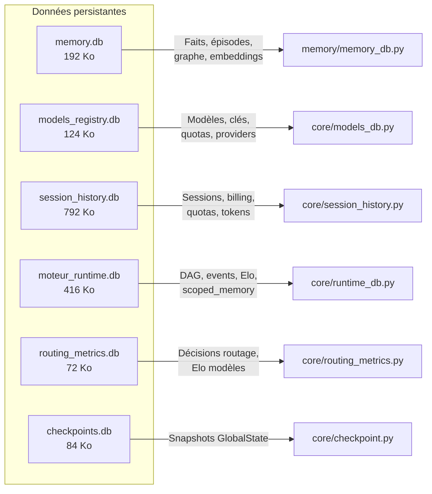
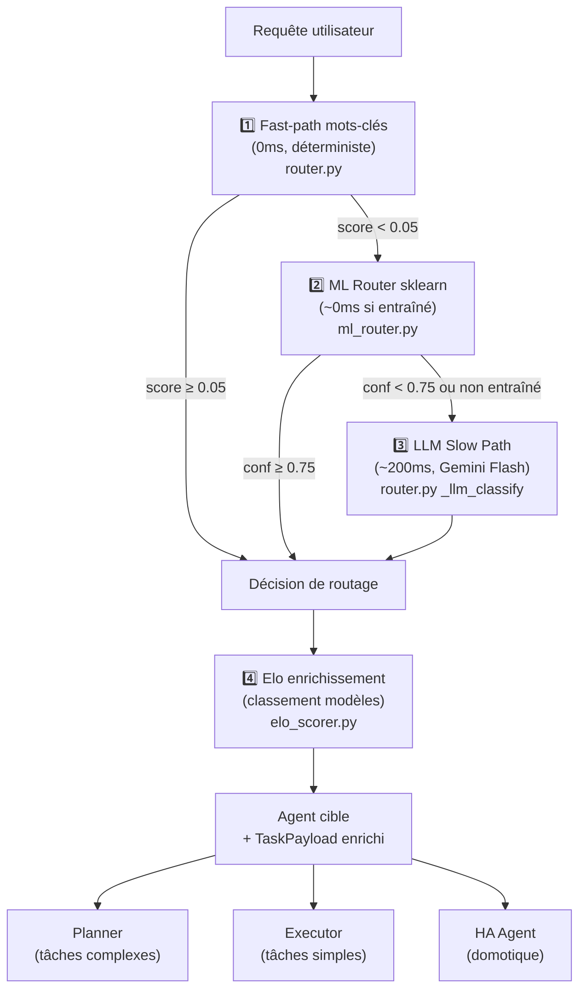
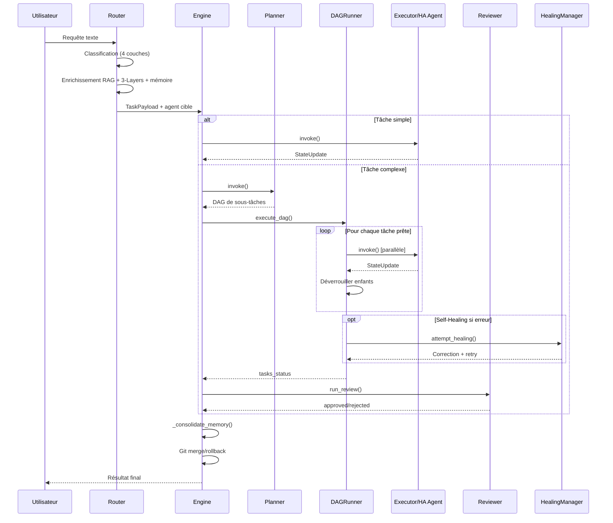

# Architecture du vromvrom-engine — V11

> **Dernière mise à jour** : 2026-06-12  
> **Version code** : V11 (Circuit Breaker V12 intégré)  
> **Espace de travail** : `e:\AuxFilsDesIdees\moteur_agents`

---

## 1. Arborescence du projet

```
moteur_agents/
├── main.py                      # Point d'entrée CLI du moteur
├── gui_server.py                # Serveur FastAPI + IHM (1905 lignes)
├── mcp_server.py                # Serveur MCP (interface Antigravity/Claude Desktop)
├── workspace_mcp.py             # Serveur MCP workspace (outils fichier/projet)
├── config.json                  # Configuration globale (tiers LLM, tokens max, etc.)
├── CLAUDE.md                    # Instructions projet pour Claude Code CLI
│
├── core/                        # 🧠 Noyau du moteur (48 modules)
│   ├── engine.py                #   Orchestrateur central (772 lignes, V11)
│   ├── router.py                #   Routeur hybride 4 couches (592 lignes, V11)
│   ├── dag_runner.py            #   Exécuteur DAG parallèle PriorityQueue (1530 lignes)
│   ├── llm_gateway.py           #   Gateway LLM + FallbackProvider (1725 lignes)
│   ├── openai_compat_provider.py#   9 providers OpenAI-compatibles factorisés 
│   ├── gemini_native.py         #   API native Gemini : caching + grounding (1011 lignes)
│   ├── circuit_breaker.py       #   Circuit Breaker CLOSED→OPEN→HALF_OPEN 
│   ├── ml_router.py             #   Classificateur ML sklearn (V10.1, 604 lignes)
│   ├── elo_router.py            #   Elo meta-scoring par routing_type 
│   ├── elo_scorer.py            #   Elo scoring par modèle LLM 
│   ├── source_router.py         #   Routing source-aware (MCP/GUI/CLI) 
│   ├── healing.py               #   Self-Healing : re-planification + correction
│   ├── review_loop.py           #   Boucle ReviewerAgent post-DAG
│   ├── hitl.py                  #   Human-In-The-Loop (pause/resume/approbation)
│   ├── factory.py               #   Factory : instanciation moteur + agents
│   ├── state.py                 #   Modèles de données (GlobalState, TaskPayload, etc.)
│   ├── serializers.py           #   Sérialiseurs JSON pour les payloads
│   ├── token_tracker.py         #   Compteur de tokens thread-safe
│   ├── key_pool.py              #   Pool rotatif de clés API (KeyPool)
│   ├── checkpoint.py            #   Persistance état moteur sur disque
│   ├── intent_splitter.py       #   Décomposition multi-intent 
│   ├── ha_fuzzy_matcher.py      #   Matcher flou pour entités Home Assistant
│   ├── ha_anomaly_detector.py   #   Détecteur d'anomalies capteurs HA
│   ├── event_store.py           #   Event Sourcing append-only 
│   ├── routing_metrics.py       #   Métriques de décisions de routage
│   ├── session_history.py       #   Historique complet des sessions (1082 lignes)
│   ├── models_db.py             #   Registre des modèles LLM (1050 lignes)
│   ├── runtime_db.py            #   BDD runtime unifiée DAG + events
│   ├── app_state.py             #   État global FastAPI (AppState singleton)
│   ├── async_db_serializer.py   #   Sérialiseur FIFO async pour accès SQLite
│   ├── cli_token_collector.py   #   Collecteur tokens CLI Antigravity
│   ├── daemon_loop.py           #   Boucle daemon sentinelle 24/7
│   ├── gcp_oauth_client.py      #   Client OAuth2 multi-scopes GCP
│   ├── langfuse_bridge.py       #   Bridge Langfuse (tracing optionnel)
│   ├── mcp_bridge.py            #   Bridge MCP → Tools internes
│   ├── plugin_registry.py       #   Registre de plugins extensible
│   ├── quota_collector.py       #   Collecteur de quotas APIs Cloud
│   ├── tab5_pusher.py           #   Push anomalies vers Tab5 via HA REST 
│   ├── visual_qa.py             #   Visual QA (capture + analyse d'IHM)
│   ├── whatsapp_service.py      #   Service WhatsApp Business API
│   ├── worker_daemon.py         #   Worker daemon pour Swarm
│   ├── worker_registry.py       #   Registre workers Swarm distants
│   ├── workflow_bridge.py       #   Bridge workflows JSON ↔ DAG
│   ├── workflow_executor.py     #   Exécuteur transitions Workflow-as-Code
│   └── errors.py                #   Classes d'erreurs personnalisées
│
├── agents/                      # 🤖 Agents spécialisés (8 modules)
│   ├── base_agent.py            #   Interface abstraite BaseAgent
│   ├── planner.py               #   Planificateur : décompose en DAG de tâches
│   ├── executor.py              #   Exécuteur : appel LLM + tools (595 lignes)
│   ├── reviewer.py              #   ReviewerAgent : évalue la qualité (score 1-10)
│   ├── ha_agent.py              #   Agent Home Assistant (commandes déterministes)
│   ├── dreamer_agent.py         #   DreamerAgent : maintenance nocturne (781 lignes)
│   ├── tool_maker_agent.py      #   ToolMakerAgent : génère des outils à la volée
│   └── antigravity_agent.py     #   Agent bridge vers Antigravity IDE
│
├── memory/                      # 🧩 Système de mémoire (11 modules)
│   ├── memory_db.py             #   BDD SQLite unifiée (faits, épisodes, graphe)
│   ├── rag.py                   #   RAG hybride triple (TF-IDF + BM25 + vectoriel)
│   ├── context_loader.py        #   Chargeur de contexte 3-Layers (Markdown)
│   ├── context_manager.py       #   Gestionnaire de contexte conversationnel
│   ├── embeddings.py            #   Interface ChromaDB (all-MiniLM-L6-v2)
│   ├── chroma_memory.py         #   Mémoire vectorielle ChromaDB persistante 
│   ├── gemini_embedding_fn.py   #   Fonction d'embedding Gemini pour ChromaDB
│   ├── episodes.py              #   Mémoire épisodique (sessions passées)
│   ├── facts.py                 #   Mémoire sémantique (faits connus)
│   ├── skills.py                #   Mémoire procédurale (skills réutilisables)
│   ├── aqa.py                   #   Attributed Question Answering (Gemini)
│   └── episodes/                #   Stockage JSON des épisodes
│
├── api/                         # 🌐 API FastAPI modulaire (V9 refactoring)
│   ├── __init__.py              #   Enregistrement des routers
│   ├── routes/                  #   20 modules de routes extraits de gui_server.py
│   │   ├── approval.py          #     HITL approbation
│   │   ├── apis_external.py     #     APIs externes (DeepSeek, Gemini, etc.)
│   │   ├── apis_status.py       #     Statut APIs + circuit breakers
│   │   ├── billing.py           #     Facturation GCP
│   │   ├── config.py            #     Configuration runtime
│   │   ├── context.py           #     Contexte RAG + 3-Layers
│   │   ├── daemon.py            #     Contrôle daemon sentinelle
│   │   ├── events.py            #     Event Store SSE
│   │   ├── execution.py         #     Lancement de sessions moteur
│   │   ├── google_workspace.py  #     Calendar, Drive, Tasks
│   │   ├── ha.py                #     Home Assistant (entités, services)
│   │   ├── metrics.py           #     Métriques Elo + routage
│   │   ├── models_admin.py      #     Administration registre modèles
│   │   ├── quotas.py            #     Quotas APIs Cloud
│   │   ├── streaming.py         #     Streaming SSE chat
│   │   ├── swarm.py             #     Workers Swarm
│   │   ├── tokens.py            #     Token tracking
│   │   ├── whatsapp.py          #     WhatsApp Business
│   │   └── workflows.py         #     Workflows JSON
│   └── services/
│       └── billing_service.py   #     Service facturation GCP
│
├── services/                    # 🔧 Services métier
│   └── pipeline_service.py      #   Pipeline d'exécution moteur (orchestrateur HTTP)
│
├── tools/                       # 🔨 Outils disponibles pour les agents (21 modules)
│   ├── tool_registry.py         #   Registre central d'outils
│   ├── git_safety.py            #   Git Safety (branches éphémères, merge/rollback)
│   ├── sandbox.py               #   Sandbox d'exécution sécurisée
│   ├── sanitizer.py             #   Sanitizer de réponses LLM
│   ├── linter.py                #   Linter YAML/Python
│   ├── system.py                #   Outils système (validate_config_yaml, etc.)
│   ├── terminal.py              #   Exécution de commandes terminal
│   ├── context_self_healing.py  #   Self-Healing du contexte 
│   ├── doc_generator.py         #   Génération automatique de documentation
│   ├── google_workspace.py      #   Outils Google Workspace (Calendar, Drive, Tasks)
│   ├── ha_entity_ingest.py      #   Ingestion d'entités HA
│   ├── failover_manager.py      #   Gestionnaire de failover MQTT 
│   ├── billing_scraper.js       #   Scraper GCP Billing (Puppeteer + Chrome)
│   ├── cloud_stt.py             #   Speech-to-Text Cloud
│   ├── cloud_tts.py             #   Text-to-Speech Cloud
│   ├── cloud_translate.py       #   Traduction Cloud
│   ├── cloud_vision.py          #   Vision Cloud
│   ├── imagen.py                #   Génération d'images (Imagen)
│   ├── minimax_image.py         #   Génération d'images (MiniMax)
│   ├── minimax_tts.py           #   TTS MiniMax
│   └── api.py                   #   Outils API génériques
│
├── tests/                       # 🧪 Tests (15 modules + unit/)
│   ├── conftest.py              #   Fixtures partagées
│   ├── test_dag_reactive.py     #   Tests DAG réactif
│   ├── test_failover.py         #   Tests failover
│   ├── test_elo_scorer.py       #   Tests Elo scorer
│   ├── test_models_db.py        #   Tests registre modèles
│   ├── test_memory_db_v9.py     #   Tests memory.db
│   ├── test_rag_improvements.py #   Tests RAG
│   ├── test_tool_maker.py       #   Tests ToolMaker
│   ├── test_visual_qa.py        #   Tests Visual QA
│   ├── test_whatsapp.py         #   Tests WhatsApp
│   ├── test_worker.py           #   Tests Swarm workers
│   ├── test_checkpoint.py       #   Tests checkpoints
│   ├── test_runtime_db.py       #   Tests runtime DB
│   ├── test_audit_integration.py#   Tests audit
│   └── unit/                    #   Tests unitaires isolés
│
├── workflows/                   # 📋 Définitions de workflows
│   └── Default.json             #   Workflow par défaut (transitions JSON)
│
├── static/                      # 🎨 IHM Dashboard FastAPI
│   ├── index.html               #   Dashboard principal
│   ├── metrics.html             #   Page métriques
│   ├── css/                     #   Styles CSS
│   └── js/                      #   Scripts JS (tabs/)
│
├── docs/                        # 📚 Documentation
│   ├── ARCHITECTURE.md          #   CE FICHIER
│   ├── CHANGELOG_AUTO.md        #   Changelog auto-généré
│   └── *.md                     #   Audits et rapports
│
├── scratch/                     # 🗂️ Scripts utilitaires ponctuels
│   ├── roadmap_v12.md           #   Roadmap V12 (en cours)
│   ├── audit_moteur_v11.md      #   Audit algorithmique V11
│   ├── *.py                     #   Scripts de diagnostic, test, migration
│   └── __pycache__/
│
├── deploy/                      # 🚀 Scripts de déploiement
├── images/                      # 🖼️ Assets images
├── backups_prod/                # 💾 Backups de production
├── checkpoints/                 # 💾 Checkpoints moteur + rapports Dreamer
├── plugins/                     # 🧩 Plugins (example_weather)
│
├── .chrome_scraper_profile/     # 🔧 Profil Chrome pour billing_scraper.js
├── chromadb_data/               # 🔧 Données ChromaDB persistantes
├── node_modules/                # 📦 Dépendances Node.js (billing scraper)
│
├── *.json                       # Fichiers de configuration
│   ├── ha_commands.json         #   Commandes HA déterministes 
│   ├── agents_workflows.json    #   Définition workflows agents
│   ├── mcp_activation_rules.json#   Règles d'activation MCP
│   ├── workers.json             #   Configuration workers Swarm
│   ├── pricing_strategy.json    #   Stratégie de pricing LLM
│   ├── daemon_context.json      #   Contexte du daemon sentinelle
│   ├── skills.json              #   Skills enregistrés
│   └── token_usage*.json        #   Usage tokens mensuel
│
├── *.db                         # Bases de données SQLite (voir section 2)
├── pyproject.toml               # Configuration Python (dependencies)
├── requirements.txt             # Dépendances pip
├── .env                         # Variables d'environnement (clés API)
├── .gitignore                   # Exclusions Git
└── .pre-commit-config.yaml      # Hooks pre-commit
```

---

## 2. Bases de Données SQLite

Le moteur utilise **5 bases de données SQLite** en mode WAL (Write-Ahead Logging).

> ⚠️ **Règle critique** : Aucune BDD SQLite ne doit être accédée via réseau (SMB/Samba).
> Les accès doivent toujours être locaux pour éviter les corruptions de verrous.



### 2.1 `memory.db` — Mémoire Unifiée (192 Ko)

| Table | Lignes | Description |
|-------|--------|-------------|
| `facts` | 10 | Faits connus (base sémantique) |
| `episodes` | 1 | Épisodes de sessions passées |
| `graph_entities` | 10 | Entités du graphe de connaissances |
| `graph_relations` | 0 | Relations entre entités |
| `embeddings` | 0 | Embeddings vectoriels (Gemini dim 3072) |
| `skills` | 0 | Skills procéduraux réutilisables |
| `query_embeddings_cache` | 0 | Cache d'embeddings de requêtes |
| `sync_metadata` | 1 | Métadonnées de synchronisation Markdown ↔ SQLite |
| `fts_facts*` | - | Index FTS5 full-text sur `facts` |

**Module propriétaire** : `memory/memory_db.py` (singleton `MemoryDB`)  
**Rôle** : Cache d'accès rapide avec recherche vectorielle hybride (TF-IDF + BM25 + Gemini Embeddings). La source de vérité reste les fichiers `.md` du dossier `contexte_ia/`.

### 2.2 `models_registry.db` — Registre des Modèles LLM (124 Ko)

| Table | Lignes | Description |
|-------|--------|-------------|
| `models` | 65 | Catalogue de modèles LLM (capacités, pricing, limites) |
| `providers` | 16 | Fournisseurs (Gemini, Anthropic, DeepSeek, etc.) |
| `access_channels` | 76 | Canaux d'accès N:N modèle ↔ clé API |
| `api_keys` | 17 | Pool de clés API avec quotas |
| `quota_realtime` | 16 | Quotas temps réel par clé |
| `benchmarks` | 17 | Benchmarks de performance |
| `routing_rules` | 9 | Règles de routage par domaine |
| `subscriptions` | 2 | Abonnements (Pro, gratuit) |

**Module propriétaire** : `core/models_db.py` (SSOT des modèles)  
**Rôle** : Source de vérité unique pour tout ce qui concerne les modèles LLM disponibles, leurs tarifs, capacités et clés d'accès.

### 2.3 `session_history.db` — Historique des Sessions (792 Ko)

| Table | Lignes | Description |
|-------|--------|-------------|
| `sessions` | 14 | Sessions d'exécution moteur |
| `billing_history` | 5389 | Historique de facturation GCP |
| `quota_snapshots` | 2434 | Snapshots de quotas (SSE pusher) |
| `ide_conversations` | 171 | Conversations IDE Antigravity |
| `token_usage` | 61 | Usage tokens par session |

**Module propriétaire** : `core/session_history.py`  
**Rôle** : Persistance longue durée de l'historique des sessions et de la facturation.

### 2.4 `moteur_runtime.db` — Runtime DAG & Events (416 Ko)

| Table | Lignes | Description |
|-------|--------|-------------|
| `dag_tasks` | 2 | Tâches du DAG en cours |
| `dag_edges` | 0 | Dépendances entre tâches |
| `scoped_memory` | 0 | Mémoire cloisonnée hiérarchique  |
| `events` | 0 | Event Store append-only  |
| `model_elo_scores` | 15 | Scores Elo par modèle LLM |
| `routing_decisions` | 450 | Historique des décisions de routage |
| `token_usage` | 241 | Usage tokens détaillé |
| `ide_conversations` | 204 | Conversations IDE |
| `billing_history` | 6 | Facturation récente |
| `swarm_workers` | 0 | Workers Swarm enregistrés |
| `sessions` | 1 | Session en cours |
| `checkpoints` | 0 | (legacy, migré vers checkpoints.db) |

**Module propriétaire** : `core/runtime_db.py`  
**Rôle** : BDD unifiée de runtime — tout ce qui concerne l'exécution en cours.

> ⚠️ **Duplication détectée** : Les tables `routing_decisions`, `token_usage`, `ide_conversations`, `billing_history` et `sessions` existent à la fois dans `moteur_runtime.db` ET `session_history.db` / `routing_metrics.db`. C'est un héritage des migrations V7→V9 qui n'a pas été consolidé. Les données les plus récentes sont dans `moteur_runtime.db`.

### 2.5 `routing_metrics.db` — Métriques de Routage (72 Ko)

| Table | Lignes | Description |
|-------|--------|-------------|
| `routing_decisions` | 255 | Décisions de routage historiques |
| `model_elo_scores` | 1 | Score Elo par modèle (doublon avec runtime) |

**Module propriétaire** : `core/routing_metrics.py`  
**Rôle** : Historique dédié aux métriques de routage. Candidat à la fusion avec `moteur_runtime.db`.

### 2.6 `checkpoints/checkpoints.db` — Checkpoints (84 Ko)

| Table | Lignes | Description |
|-------|--------|-------------|
| `checkpoints` | 1 | Snapshots sérialisés de GlobalState |

**Module propriétaire** : `core/checkpoint.py`  
**Rôle** : Persistance disque de l'état du moteur pour reprise après crash.

### 2.7 Stockage vectoriel : `chromadb_data/`

Dossier de persistance ChromaDB (embeddings all-MiniLM-L6-v2).  
**Modules** : `memory/embeddings.py`, `memory/chroma_memory.py`, `memory/gemini_embedding_fn.py`  
**Rôle** : Recherche vectorielle pour le RAG hybride triple. Optionnel — le moteur fonctionne sans ChromaDB (fallback TF-IDF + BM25).

---

## 3. Pipeline de Routage (4 couches)



### Distinction Elo Router vs Elo Scorer

| Module | Rôle | Table SQLite | Entités scorées |
|--------|------|-------------|-----------------|
| `elo_router.py`  | Meta-scoring des **types de routage** | `elo_routing` dans `moteur_runtime.db` | `home_assistant`, `casual_chat`, `analysis`, `code_generation` |
| `elo_scorer.py`  | Scoring des **modèles LLM** par domaine | `model_elo_scores` dans `moteur_runtime.db` | `gemini-2.5-flash`, `deepseek-r1`, etc. |

---

## 4. Flux d'exécution principal



---

## 5. Fichiers de configuration

| Fichier | Description |
|---------|-------------|
| `config.json` | Tiers LLM, budget tokens max, auto_review, modèles par tier |
| `.env` | Clés API (GEMINI_API_KEY, DEEPSEEK_API_KEY, etc.) |
| `ha_commands.json` | Table de commandes HA déterministes  |
| `agents_workflows.json` | Définitions de workflows pour le Workflow-as-Code |
| `workers.json` | Configuration des workers Swarm distants |
| `pricing_strategy.json` | Tarifs et stratégie de routage économique |
| `mcp_activation_rules.json` | Règles d'activation des outils MCP |
| `daemon_context.json` | État du daemon sentinelle |

---

## 6. Dépendances externes

| Service | Usage | Module |
|---------|-------|--------|
| LM Studio (${LMSTUDIO_HOST:-localhost}:1234) | Inférence locale (RTX 5070Ti) | `LMStudioProvider` |
| Ollama Deck (${OLLAMA_HOST:-localhost}/139:11434) | Inférence Edge (Steam Deck RDNA2) | `OllamaDeckProvider` |
| Home Assistant (192.168.x.x:8123) | Domotique REST API | `ha_agent.py`, `tab5_pusher.py` |
| Gemini API | LLM Cloud + embeddings + grounding | `gemini_native.py`, `GeminiProvider` |
| Anthropic (Claude CLI) | LLM Cloud via CLI local | `ClaudeCLIProvider` |
| ChromaDB (local) | Vectorstore persistant | `memory/chroma_memory.py` |
| Langfuse (optionnel) | Tracing/observabilité | `langfuse_bridge.py` |
